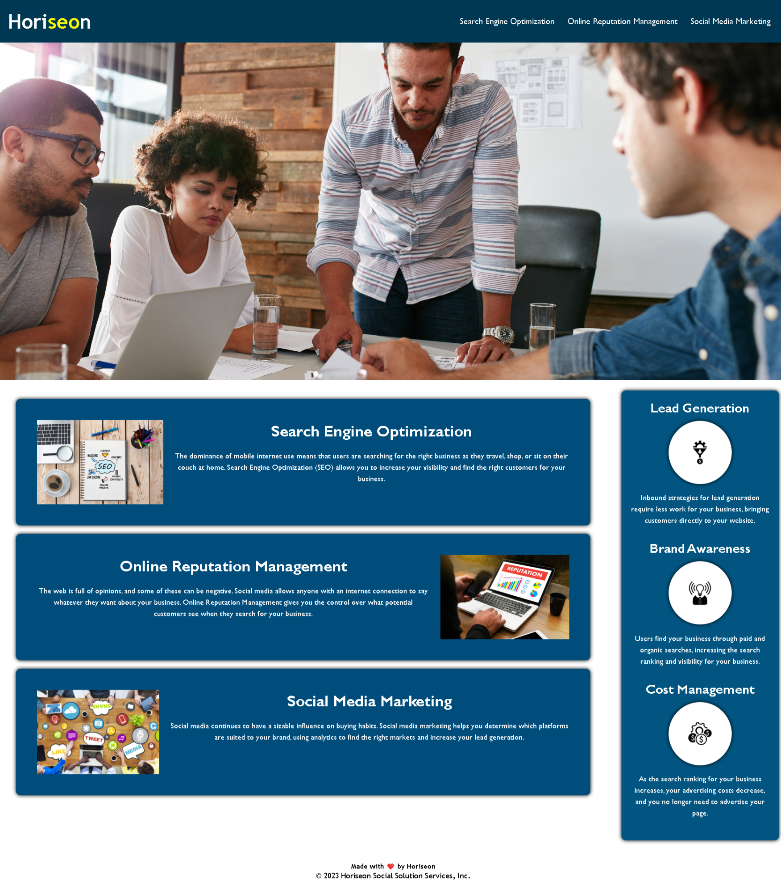

# Horiseon Marketing Website Code Refactor
   Repository link:
      https://github.com/fredm23579/marketing-website-module1

## Your Task

**Refactoring** existing code (improving it without changing what it does) to meet a certain set of standards.  

An increasingly important consideration for businesses, web **accessibility** ensures that people with disabilities can access a website using assistive technologies like video captions, screen readers, and braille keyboards. Accessibility is good for business&mdash;for one thing, accessible sites rank higher in search engines like Google. It also helps companies avoid litigation, which might arise if people with disabilities can't access a website.

Accessibility can include complex requirements, but some of these criteria are documented in the Acceptance Criteria section.

## User Story

```
AS A marketing agency
I WANT a codebase that follows accessibility standards
SO THAT our own site is optimized for search engines
```

## Acceptance Criteria

```
GIVEN a webpage meets accessibility standards
WHEN I view the source code
THEN I find semantic HTML elements
WHEN I view the structure of the HTML elements
THEN I find that the elements follow a logical structure independent of styling and positioning
WHEN I view the icon and image elements
THEN I find accessible alt attributes
WHEN I view the heading attributes
THEN they fall in sequential order
WHEN I view the title element
THEN I find a concise, descriptive title
```

## Horiseon Marketing Website

## Overview

Horiseon is a digital marketing agency specializing in Search Engine Optimization (SEO), Social Media Marketing, and Online Reputation Management. This repository contains the code for the Horiseon marketing website, which is designed to be fully responsive, accessible, and SEO-friendly.
( https://github.com/fredm23579/marketing-website-module1 )

## Screenshot of the Horiseon Marketing Website



## Features

* Responsive Design: Ensures a seamless experience on devices of all sizes.
* Accessibility-Optimized: Implements features like alt text for images and semantic HTML for enhanced accessibility.
* SEO-Friendly: Optimized with appropriate meta tags and semantic HTML structure.

## Live Demo

You can view the live version of the website here: [https://github.io/fredm23579/marketing-website-module1/Develop/index.html](https://fredm23579.github.io/marketing-website-module1/Develop/index.html)

## Repository

The source code is available on GitHub: Horiseon Marketing Repository.

## Clone the repository:

git clone https://github.com/fredm23579/marketing-website-module1.git

git clone git@github.com:fredm23579/marketing-website-module1.git

## Open index.html in a web browser to view the website:

[https://github.io/fredm23579/marketing-website-module1/Develop/index.html](https://fredm23579.github.io/marketing-website-module1/Develop/index.html)

## Accessibility

This site is designed with accessibility in mind, following WCAG guidelines to ensure it's usable by as many people as possible. Features include:

* Screen reader compatibility.
* Keyboard navigation support.
* Higher-contrast color scheme for better readability.

## Links

* The URL of the deployed application: [https://fredm23579.github.io/marketing-website-module1/Develop/index.html](https://fredm23579.github.io/marketing-website-module1/Develop/index.html)

* The URL of the GitHub repository, with a unique name and a README : https://github.com/fredm23579/marketing-website-module1

## Contact Info
For questions or comments, please contact ume at motta@g.ucla.edu.
---

